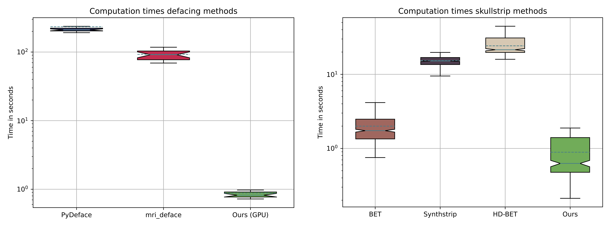

# De-Identification of Medical Imaging Data: A Comprehensive Tool for Ensuring Patient Privacy

[](https://www.python.org/downloads/release/python-3120/) 
[](https://github.com/psf/black)
[](./LICENSE)
![Open Source Love][0c]
[](https://hub.docker.com/r/morrempe/hold)

[0c]: https://badges.frapsoft.com/os/v2/open-source.svg?v=103


<div align="center">

[Getting started](#getting-started) • [Usage](#usage) • [Citation](#citation)

</div>

This repository contains the **De-Identification of Medical Imaging Data: A Comprehensive Tool for Ensuring Patient Privacy**, which enables the user to anonymize a wide variety of medical imaging types, including Magnetic Resonance Imaging (MRI), Computer Tomography (CT), Ultrasound (US), Whole Slide Images (WSI) or MRI raw data (twix).

<div align="center">


</div>


This tool combines multiple anonymization steps, including metadata deidentification, defacing and skull-stripping while being faster than current state-of-the-art deidentification tools.



## Getting started

You can install the anonymization tool either directly via git, by cloning this repository or via Docker. 

### Installation via Git

1. Clone repository:
   
       git clone ...

2. Create a conda environment with Python version 3.12.4 and install the necessary dependencies:
   
       conda create -n my_env python=3.12.4 --file requirements.txt
    In case of installation issues with conda, use pip install -r requirements.txt to install the dependecies.

3. Activate your new environment:

       conda activate my_env

4. Run the script with the corresponding cli parameter, e.g.:

       python3 deidentify.py [your flags]

### Installation via Docker
Alternatively this tool is distributed via docker. You can find the docker images [here](https://hub.docker.com/r/morrempe/hold). The docker image is available for amd64 and arm64 platforms.

For the installation and execution of the docker image, you must have [Docker](https://docs.docker.com/get-docker/) installed on your system.

1. Pull the docker image

       docker pull morrempe/hold:[tag]   (either arm64 or amd64)

2. Run the docker container with attached volume. Your data will be mounted in the ````data```` folder:

       docker run --rm -it -v [Path/to/your/data]:/data morrempe/hold:[tag]

3. Run the script with the corresponding cli parameter, e.g.:

       python3 deidentify.py [your flags]

## Usage
**Twix Anonymization CLI**
```
usage: deidentify.py [-h] [-v | --verbose | --no-verbose] [-t | --text-removal | --no-text-removal] [-i INPUT]
                                    [-o OUTPUT] [--gpu GPU] [-s | --skull_strip | --no-skull_strip] [-de | --deface | --no-deface]
                                    [-tw | --twix | --no-twix] [-p PROCESSES]
                                    [-d {basicProfile,cleanDescOpt,cleanGraphOpt,cleanStructContOpt,rtnDevIdOpt,rtnInstIdOpt,rtnLongFullDatesOpt,rtnLongModifDatesOpt,rtnPatCharsOpt,rtnSafePrivOpt,rtnUIDsOpt} [{basicProfile,cleanDescOpt,cleanGraphOpt,cleanStructContOpt,rtnDevIdOpt,rtnInstIdOpt,rtnLongFullDatesOpt,rtnLongModifDatesOpt,rtnPatCharsOpt,rtnSafePrivOpt,rtnUIDsOpt} ...]]

options:
  -h, --help            show this help message and exit
  -v, --verbose, --no-verbose
  -t, --text-removal, --no-text-removal
  -i INPUT, --input INPUT
                        Path to the input data.
  -o OUTPUT, --output OUTPUT
                        Path to save the output data.
  --gpu GPU             GPU device number. (default 0)
  -s, --skull_strip, --no-skull_strip
  -de, --deface, --no-deface
  -tw, --twix, --no-twix
  -w, --wsi, --no-wsi
  -p PROCESSES, --processes PROCESSES
                        Number of processes to use for multiprocessing.
  -d {basicProfile,cleanDescOpt,cleanGraphOpt,cleanStructContOpt,rtnDevIdOpt,rtnInstIdOpt,rtnLongFullDatesOpt,rtnLongModifDatesOpt,rtnPatCharsOpt,rtnSafePrivOpt,rtnUIDsOpt} [{basicProfile,cleanDescOpt,cleanGraphOpt,cleanStructContOpt,rtnDevIdOpt,rtnInstIdOpt,rtnLongFullDatesOpt,rtnLongModifDatesOpt,rtnPatCharsOpt,rtnSafePrivOpt,rtnUIDsOpt} ...], --deidentification-profile {basicProfile,cleanDescOpt,cleanGraphOpt,cleanStructContOpt,rtnDevIdOpt,rtnInstIdOpt,rtnLongFullDatesOpt,rtnLongModifDatesOpt,rtnPatCharsOpt,rtnSafePrivOpt,rtnUIDsOpt} [{basicProfile,cleanDescOpt,cleanGraphOpt,cleanStructContOpt,rtnDevIdOpt,rtnInstIdOpt,rtnLongFullDatesOpt,rtnLongModifDatesOpt,rtnPatCharsOpt,rtnSafePrivOpt,rtnUIDsOpt} ...]
                        Which DICOM deidentification profile(s) to apply. (default None)
```

## Citation

If you use our tool in your work, please cite us with the following BibTeX entry.
```latex
@misc{rempe2024deidentificationmedicalimagingdata,
      title={De-Identification of Medical Imaging Data: A Comprehensive Tool for Ensuring Patient Privacy}, 
      author={Moritz Rempe and Lukas Heine and Constantin Seibold and Fabian Hörst and Jens Kleesiek},
      year={2024},
      eprint={2410.12402},
      archivePrefix={arXiv},
      primaryClass={eess.IV},
      url={https://arxiv.org/abs/2410.12402}, 
}
```

